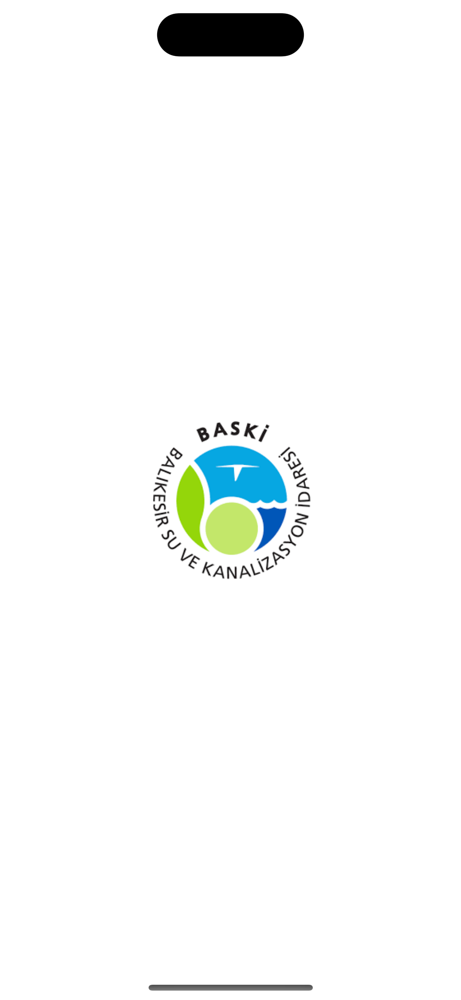
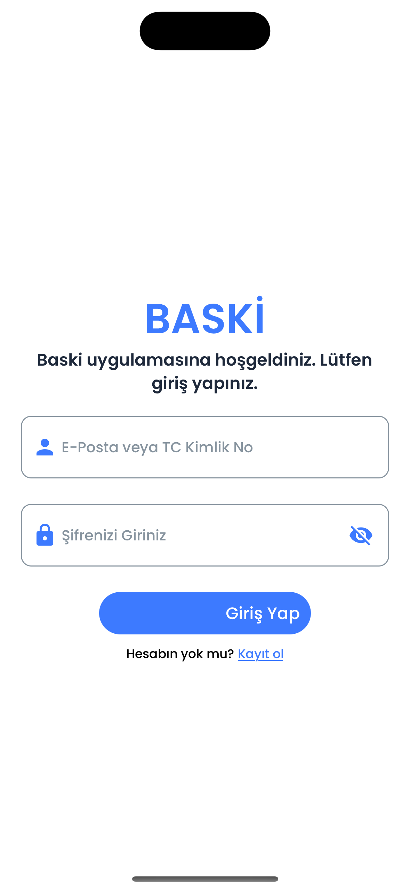
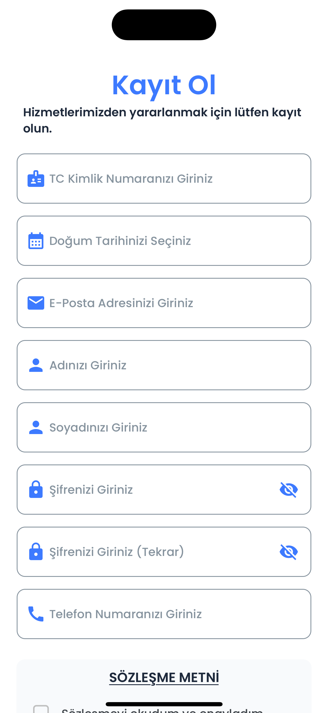
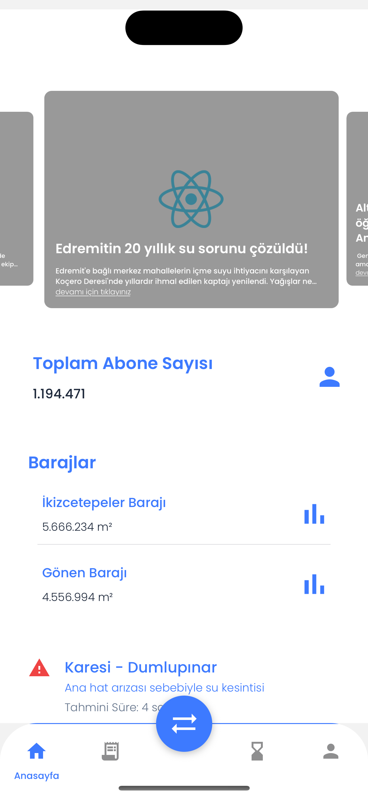
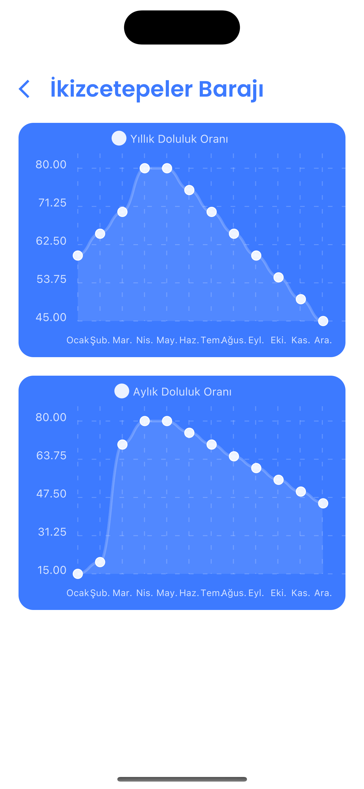
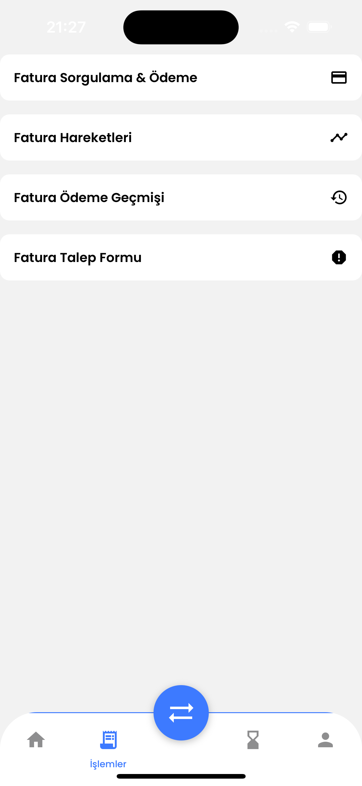
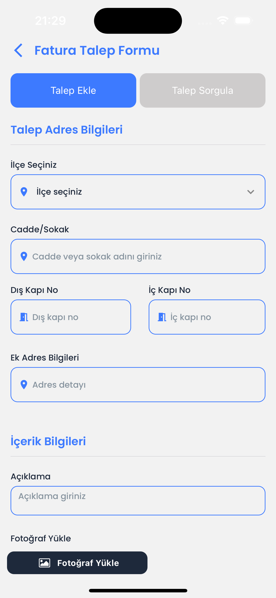

# BASKİ Mobil Uygulaması

Balıkesir Su ve Kanalizasyon İdaresi (BASKİ) abonelerine yönelik tasarlanmış, **React Native + Expo** tabanlı bir mobil uygulama prototipidir. Abonelerin fatura işlemlerini yürütmesini, baraj doluluk oranlarını takip etmesini, su kesintisi/arıza duyurularını görmesini ve talep formu göndermesini hedefler.

> **Not:** Proje geliştirme aşamasındadır. Şu an backend/API entegrasyonu bulunmamakta, ekranlar `DUMMY_DATA` üzerinden beslenmektedir.

<p align="left">
  
  
  
  
  
</p>

---

## 📱 Ekran Görüntüleri

<table>
  <tr>
    <td align="center"><br><sub><b>Splash</b></sub></td>
    <td align="center"><br><sub><b>Giriş</b></sub></td>
    <td align="center"><br><sub><b>Kayıt Ol</b></sub></td>
    <td align="center"><br><sub><b>Anasayfa</b></sub></td>
  </tr>
  <tr>
    <td align="center"><br><sub><b>Baraj Doluluk Grafikleri</b></sub></td>
    <td align="center"><br><sub><b>Fatura İşlemleri</b></sub></td>
    <td align="center"><br><sub><b>Fatura Sorgulama</b></sub></td>
    <td align="center"><br><sub><b>Fatura Hareketleri</b></sub></td>
  </tr>
  <tr>
    <td align="center"><br><sub><b>Fatura Talep Formu</b></sub></td>
    <td></td><td></td><td></td>
  </tr>
</table>

<sub>Görüntüler iOS 18.5 / iPhone 16 simülatöründe, `npx expo run:ios` ile üretilen development build üzerinden alınmıştır.</sub>

---

## ✨ Özellikler

### Kimlik Doğrulama
- **Splash ekranı** — Poppins fontları yüklenirken logo gösterilir, 3 saniye sonra giriş ekranına yönlendirilir.
- **Giriş (Login)** — E-posta veya TC Kimlik No + şifre ile giriş. Girilen bilgiler Redux `loginSlice` üzerinde tutulur.
- **Kayıt Ol (Register)** — TC kimlik no, doğum tarihi (takvim modalı), e-posta, ad, soyad, şifre + şifre tekrarı, telefon numarası alanları; ayrıca modal içinde okunabilen **KVKK uyumlu kullanıcı sözleşmesi** ve onay kutusu.

### Anasayfa
- **Haber & duyuru karuseli** — `react-native-reanimated-carousel` ile otomatik geçişli slider; "Detay" butonu haberin `balsu.gov.tr` sayfasını cihazın tarayıcısında açar.
- **Toplam abone sayısı** kartı.
- **Baraj doluluk kartları** — İkizcetepeler ve Gönen barajları; karta dokununca detay ekranına gidilir.
- **Arıza & kesinti kartları** — mahalle bazlı kesinti/planlı bakım bildirimleri, tahmini süre bilgisi ve duruma göre renklendirilmiş ikonlar (hata / uyarı).

### Baraj Detay Ekranı
- `react-native-chart-kit` `LineChart` ile **yıllık** ve **aylık** doluluk oranı grafikleri (bezier eğrisi, beyaz üzerine mavi tema).
- Grafik noktaları üzerine yerleştirilmiş şeffaf dokunma alanları ile nokta seçimi.
- Barajın güncel doluluk yüzdesi ve son güncelleme tarihi.

### Fatura İşlemleri
Sekmeden erişilen dört alt ekran:

| Ekran | Durum | Açıklama |
|---|---|---|
| **Fatura Sorgulama & Ödeme** | UI hazır | Abone No / TC Kimlik No ile sorgulama formu |
| **Fatura Hareketleri** | UI hazır | Son 1 ay – 2 yıl arası filtre butonları, ödenmiş/ödenmemiş durumuna göre renkli tutar listesi |
| **Fatura Ödeme Geçmişi** | 🚧 İskelet | Ekran oluşturuldu, içerik bekliyor |
| **Fatura Talep Formu** | UI hazır | İki sekmeli yapı: *Talep Ekle* ve *Talep Sorgula* |

### Talep Formu (Fatura Talep Formu → Talep Ekle)
- **Adres seçimi** — Balıkesir'in **18 ilçesi ve 886 mahallesi** yerel JSON dosyasından okunur; ilçe seçimi mahalle listesini dinamik olarak filtreler (`react-native-element-dropdown`).
- Sokak, dış kapı no, iç kapı no, ek adres tarifi ve talep açıklaması alanları.
- **Görsel ekleme** — `expo-image-picker` ile galeriden çoklu fotoğraf/video seçimi, izin yönetimi ve seçilen görselleri tek tek kaldırma.
- **Belge ekleme** — `expo-document-picker` ile çoklu PDF yükleme.
- Form durumunun tamamı Redux `addRequestInfoSlice` üzerinde tutulur; gönderim sonrası state sıfırlanır.
- **Başarı animasyonu** — `lottie-react-native` ile gösterilen onay modalı (3 saniye sonra otomatik kapanır).

### Talep Sorgulama
- TC Kimlik No (11 hane) + talep takip numarası (8 hane) ile geçmiş talep sorgulama formu.

### Navigasyon
- **5 sekmeli alt menü** — Anasayfa, İşlemler, *(ortada yüzen buton)* Hızlı İşlemler, Başvurular, Profil.
- Sekme etiketleri yalnızca aktif sekmede görünür; alt bar üstten yuvarlatılmış ve ortasında öne çıkan dairesel aksiyon butonu vardır.

---

## 🛠 Teknoloji Yığını

### Çekirdek
| Teknoloji | Sürüm | Kullanım amacı |
|---|---|---|
| [Expo](https://expo.dev) | SDK ~52.0 | Geliştirme platformu, native modül yönetimi |
| [React Native](https://reactnative.dev) | 0.76.5 | Mobil UI çatısı (**New Architecture** açık) |
| [React](https://react.dev) | 18.3.1 | Bileşen modeli |
| [TypeScript](https://www.typescriptlang.org) | ^5.3.3 | `strict` mod, `@/*` path alias'ları |
| [Expo Router](https://docs.expo.dev/router/introduction) | ^4.0 | Dosya tabanlı yönlendirme, *typed routes* |

### Durum Yönetimi
| Paket | Kullanım |
|---|---|
| `@reduxjs/toolkit` | `configureStore`, `createSlice` |
| `react-redux` | `Provider`, `useSelector`, `useDispatch` |

Store üç slice içerir:
- **`login`** — oturum açan kullanıcının e-posta/şifre bilgisi
- **`addRequestState`** — talep formunun tüm alanları (adres, açıklama, görseller, belgeler)
- **`counter`** — Redux kullanımını göstermek için eklenmiş örnek slice

### UI & Görselleştirme
| Paket | Kullanım |
|---|---|
| `@rneui/themed`, `@rneui/base` | Input, Button, Tab, Divider, Card, Icon bileşenleri |
| `react-native-vector-icons` / `@expo/vector-icons` | MaterialIcons ikon seti |
| `@expo-google-fonts/poppins` | Poppins font ailesi (Title: SemiBold 600, Body: Medium 500, Small: Light 300) |
| `react-native-chart-kit` | Baraj doluluk oranı çizgi grafikleri |
| `react-native-reanimated-carousel` | Haber/duyuru slider'ı |
| `react-native-reanimated` + `react-native-gesture-handler` | Animasyon ve jest altyapısı |
| `lottie-react-native` | Talep gönderimi başarı animasyonu |
| `react-native-element-dropdown` | İlçe/mahalle seçim listeleri |
| `react-native-ui-datepicker` + `dayjs` | Doğum tarihi seçimi |
| `@gorhom/bottom-sheet`, `@expo/react-native-action-sheet` | Alttan açılan paneller |
| `react-native-safe-area-context` | Çentik/durum çubuğu güvenli alan yönetimi |

### Cihaz Yetenekleri
`expo-image-picker` · `expo-document-picker` · `react-native-permissions` · `expo-web-browser` · `expo-splash-screen` · `expo-font` · `expo-status-bar` · `expo-haptics` · `react-native-webview`

### Test
`jest` + `jest-expo` preset (`npm test`) — henüz yazılmış test bulunmuyor.

---

## 📁 Proje Yapısı

```
BaskiApp/
├── app/                              # Expo Router — dosya tabanlı yönlendirme
│   ├── _layout.tsx                   # Kök Stack + Redux Provider + GestureHandler
│   ├── index.tsx                     # Splash ekranı
│   ├── login.tsx                     # Giriş
│   ├── register.tsx                  # Kayıt + kullanıcı sözleşmesi modalı
│   ├── (tabs)/                       # Alt sekme grubu
│   │   ├── _layout.tsx               # Özel tab bar (ortada yüzen buton)
│   │   ├── home.tsx                  # Anasayfa
│   │   ├── bill_transactions.tsx     # Fatura işlemleri menüsü
│   │   ├── fast_transactions.tsx     # Hızlı işlemler (iskelet)
│   │   ├── applications.tsx          # Başvurularım (iskelet)
│   │   └── profile.tsx               # Profil (iskelet)
│   ├── (home)/
│   │   └── DamDetailNewScreen.tsx    # Baraj doluluk grafikleri
│   └── (bill_transaction)/
│       ├── BillEnquiryScreen.tsx     # Fatura sorgulama & ödeme
│       ├── BillMovementScreen.tsx    # Fatura hareketleri
│       ├── BillPaymentHistoryScreen.tsx
│       └── BillObjectionFormScreen.tsx
├── components/
│   ├── home/                         # Slider, abone kartı, baraj kartı, arıza kartı
│   ├── login/                        # E-posta, şifre, giriş butonu
│   ├── register/                     # TC no, doğum tarihi, ad, soyad, telefon, sözleşme
│   └── bill_transactions/            # Talep ekle/sorgula sekmeleri, işlem kartı, başarı modalı
├── store/
│   ├── index.tsx                     # configureStore + RootState / AppDispatch tipleri
│   └── slices/                       # loginSlice, addRequestInfoSlice, counterSlice
├── constants/
│   ├── Colors.tsx                    # Renk paleti
│   ├── Fonts.tsx                     # Poppins yükleyici + font sabitleri
│   └── TypeScriptRefresher.tsx       # Geliştirici notları (uygulamada kullanılmıyor)
├── assets/
│   ├── districts/Districts_Neighborhoods.json   # 18 ilçe, 886 mahalle
│   ├── animations/success.json       # Lottie animasyonu
│   ├── fonts/ · images/
└── android/                          # Prebuild ile üretilmiş native Android projesi
```

---

## 🎨 Tasarım Sistemi

Renkler `constants/Colors.tsx` içinde merkezî olarak tanımlıdır:

| Token | Değer | |
|---|---|---|
| `primary` | `#3d7aff` | Ana marka mavisi |
| `primaryLight` | `#60A5FA` | |
| `background` | `#FFFFFF` | |
| `backgroundSecondary` | `#F8FAFC` | |
| `title` / `subtitle` / `text` | `#1E293B` / `#475569` / `#64748B` | Metin hiyerarşisi |
| `success` / `error` / `warning` / `info` | `#22C55E` / `#EF4444` / `#F59E0B` / `#3B82F6` | Durum renkleri |
| `border` / `divider` | `#E2E8F0` / `#F1F5F9` | |

Tipografi: **Poppins** — `poppinsFontTitle` (SemiBold), `poppinsFontBody` (Medium), `poppinsFontSmall` (Light).

---

## 🚀 Kurulum

### Gereksinimler
- Node.js 18+
- iOS için: Xcode + CocoaPods · Android için: Android Studio + JDK 17+

### Adımlar

```bash
git clone https://github.com/yusufyildiz41/BaskiApp.git
cd BaskiApp
npm install
```

Geliştirme sunucusunu başlatın:

```bash
npx expo start
```

Projede Expo Go'da bulunmayan native modüller (`react-native-permissions`, `react-native-date-picker`, `react-native-image-picker` vb.) kullanıldığı için **development build** ile çalıştırmanız önerilir:

```bash
npx expo run:ios       # iOS simülatörü
npx expo run:android   # Android emülatörü
```

### Betikler

| Komut | Açıklama |
|---|---|
| `npm start` | Expo geliştirme sunucusu |
| `npm run ios` | iOS development build üretip çalıştırır |
| `npm run android` | Android development build üretip çalıştırır |
| `npm run web` | Web (React Native Web) |
| `npm test` | Jest (watch modunda) |
| `npm run lint` | ESLint (`expo lint`) |

---

## 🗺 Yol Haritası

- [ ] Backend/API entegrasyonu (şu an tüm veriler `DUMMY_DATA`)
- [ ] Gerçek kimlik doğrulama, token yönetimi ve oturum kalıcılığı
- [ ] Profil, Başvurularım ve Hızlı İşlemler ekranlarının tamamlanması
- [ ] Fatura Ödeme Geçmişi ekranının doldurulması
- [ ] Ödeme altyapısı entegrasyonu
- [ ] Form doğrulama (TC kimlik no algoritması, e-posta, şifre eşleşmesi)
- [ ] Şifrenin Redux store yerine güvenli depoda (`expo-secure-store`) tutulması
- [ ] Push bildirim ile kesinti/arıza uyarıları
- [ ] Karanlık tema desteği (`userInterfaceStyle: "automatic"` tanımlı, uygulanmadı)
- [ ] Birim ve bileşen testleri

---

## 🐞 Bilinen Sorunlar

Projeyi iOS simülatöründe ayağa kaldırırken karşılaşılan ve düzeltilen/tespit edilen noktalar:

| Sorun | Durum |
|---|---|
| `react-native-svg` bağımlılığı eksikti — `react-native-chart-kit` bu pakete ihtiyaç duyduğu için baraj detay ekranı *"Unimplemented component: `<RNSVGSvgView>`"* hatası veriyordu | ✅ `react-native-svg@15.8.0` eklendi |
| `app.json` içindeki `expo-splash-screen` yapılandırması var olmayan `./assets/images/splash-icon.png` dosyasına işaret ediyordu, bu da `expo prebuild` adımını kırıyordu | ✅ Mevcut `splash-logo.png` ile değiştirildi |
| `@react-native-vector-icons/common@11` paketi React Native 0.76 New Architecture codegen'i ile derlenmiyor (`NativeVectorIconsSpec` / `NativeRNVectorIconsSpec` isim uyuşmazlığı). Paket kaynak kodda hiç kullanılmıyor | ⚠️ `@react-native-vector-icons/*` paketleri kaldırılabilir |
| `Fatura Talep Formu` ekranında sekme değişimi denemelerimizde tepki vermedi. `TabItem`, `@rneui/themed` yerine `@rneui/base/dist/Tab/Tab.Item` iç yolundan import ediliyor | ⚠️ Doğrulanmadı — gerçek cihazda/dokunmayla teyit edilmeli |
| Giriş şifresi Redux store içinde düz metin olarak saklanıyor | ⚠️ Açık |

---

## ⚠️ Güvenlik Notu

Bu depo, `b90d77c` commit'ine kadar kök dizininde **`preinstall.js`** adlı, npm'in `preinstall` yaşam döngüsü kancasına bağlanmış çok katmanlı şifrelenmiş zararlı bir betik barındırıyordu. Betik `npm install` çalıştırıldığında otomatik olarak tetikleniyor ve uzaktan ikinci aşama kod indirip çalıştırıyordu.

Dosya ve `package.json` içindeki `preinstall` betiği kaldırılmıştır. Depoyu daha eski bir commit'ten klonladıysanız `npm install` **çalıştırmayın**; önce `preinstall.js` dosyasını ve `package.json`'daki ilgili satırı silin.

---

## 📄 Lisans

Bu proje kişisel/eğitim amaçlı geliştirilmiş bir prototiptir. BASKİ (Balıkesir Su ve Kanalizasyon İdaresi) ile resmî bir bağlantısı yoktur; kurum adı, logosu ve içerikleri yalnızca örnekleme amacıyla kullanılmıştır.
